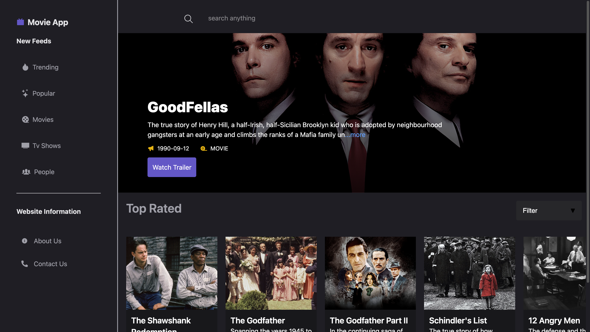

# 🎬 Movie App

A Netflix/ZEE5-like movie browsing platform built with **React**, using TMDB API for movie data.

## 🚀 Features
- Browse trending, popular, top-rated movies & TV shows.
- Search by title.
- Integrated TMDB API.

## 🛠️ Tech Stack
- **Frontend:** React, CSS/Tailwind
- **API:** TMDB (The Movie Database)
- **Icons:** React Icons

## 📷 Screenshots



## 🔧 Installation
```bash
git clone https://github.com/<your-username>/movie-app.git
cd movie-app
npm install
npm start
